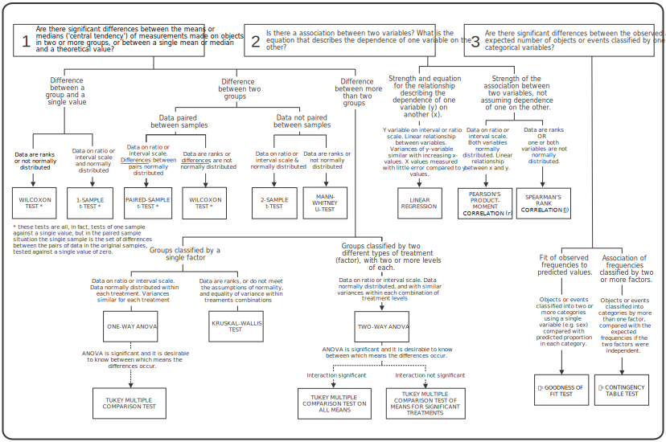

# Choosing models and tests

## Introduction {#intro}

One of the more difficult skills in data analysis is deciding which statistical models and tests to use in a particular situation. This book has introduced a range of different approaches and has demonstrated various biological questions that can be addressed with these tools. Here we draw together the statistical analyses we've encountered and explain how to match them to particular kinds of questions or hypotheses. However, there are a few things to consider before diving into an analysis.

### Do we need to carry out a statistical analysis?

This may seem like an odd question to ask, having just spent a considerable amount of time learning statistics. But it is an important one. There are many situations in which we don't need, or can't use, statistical tools. Here are two common ones:

1.  *There are no statistical procedures that will allow us to analyse our data correctly*[^choosing-models-1]. This happens sometimes. Even with careful planning, things don't always work out as anticipated, and we end up with data that cannot be analysed with a technique we know about. If the data can't be analysed sensibly, there is no point in doing any old analysis because we feel we have to produce a *p*-value. Instead, it's time to seek some advice.

2.  *We could quite correctly apply a statistical test to your data, but it would be entirely superfluous.* We don't always need statistics to tell us what is going on. An effect may be exceptionally strong and clear, or it may be that the importance of the result is not something captured by applying a particular statistical model or test[^choosing-models-2]. This caveat is particularly relevant to exploratory studies, where the goal is to use the data to generate new hypotheses rather than test *a priori* hypotheses.

[^choosing-models-1]: Alternatively, an appropriate technique exists, but we don't know about it!

[^choosing-models-2]: As the old joke goes: *What does a statistician call it when ten mice have their heads cut off and one survives? Not significant.*

Also in the category of superfluous statistics are situations where we are using statistics in a technically correct way, but we're evaluating effects that are not interesting or relevant to the question at hand. This often arises from a misplaced worry that unless we have lots of statistics in our study, it somehow isn't 'scientific', so we apply them to everything in the hope that a reader will be impressed. Resist the temptation! This strategy will have the opposite effect---a knowledgeable reader will assume you don't know what you're doing if they see a load of pointless analyses.

## Getting started

If there is a need for statistical analysis, then the first thing to do is read the data into R and then... resist the temptation to start generating *p*-values! There are several things to run through before leaping into a statistical analysis:

1.  Be sure to carefully review the data after importing it into R (functions like `View` and `glimpse` is good for this). There are a number of things to look out for:

    -   *Check the data set 'tidy'* --- Each variable should be one column and each row should correspond to one observation. The majority of statistical modelling tools in R expect the data to be organised in this format, as do packages like **dplyr** and **ggplot2**. A data set will need to be reorganised if it isn't already tidy. We can do this by hand, but it is almost always quicker to do it with R (the **tidyr** package is a good option).
    -   *Understand how R has encoded the variables* --- Examine the data using functions like `glimpse`. Pay close attention to the variable types---are they numeric, a character, or a factor? If a variable is not appropriate for the planned analysis, make any necessary changes. For example, if we plan to treat a variable as a factor but it has been read in as a number, we'd need to convert it to a factor before preceding.
    -   *Check whether or not there are any missing values* --- These appear as `NA` in R. If they are present, were they expected? If not, check the original data source to determine what has happened. If we're absolutely certain the missing values represent an error in the way the data were coded then it might be sensible to fix the source data. However, if there is any doubt about how they arose, it is better to leave the source data alone and deal with the miscoded `NA`s in the R script.

2.  Spend some time thinking about the variables in the data set. Which ones are relevant to the question in hand? If appropriate, decide which variable is the dependent variable (the 'y' variable) and which variable(s) is (are) the independent variable(s)? What kind of variables are we dealing with---ratio or interval scale numeric variables, ordinal or nominal categorical variables? It is much easier to determine which analysis options are available once these details are straightened out.

3.  Make at least one figure to visualise the data. We have done this throughout this book. This wasn't to fill the time---it is a crucial step in any data analysis exercise. Informative figures allow us to spot potential problems with the data, and they give us a way to evaluate our question before diving into an analysis. If we can't see an appropriate way to visualise the data, we probably aren't ready to start doing the statistics!

Steps 1-3 are all critical components of 'real world' data analysis. It may be tempting to skip these and just get on with the statistics, especially when pressed for time. Don't do this! The 'skip to the stats' strategy will waste time because we fail to spot potential problems and carry out an inappropriate analysis.

## A key to choosing statistical models and tests

The choice of appropriate statistical model/test is affected by two things:

1.  The kind of question we are asking.

2.  The nature of data we have:

    -   what type of variables: ratio, interval, ordinal or nominal?
    -   are the assumptions of a particular model or test satisfied by the data?

The schematic key (below) provides an overview of the statistical models and tests we've covered in this book, structured in the form of a key. The different choices in the key are determined by a combination of the type of question being asked, and the nature of the data under consideration.

```{r stats-key, echo = FALSE, out.width='100%', fig.align='center', fig.cap='A key for choosing statistical models and tests.'}

```

The notes that follow the key expand on some of the issues it summarises and explain some of the trickier elements of deciding what to do. The key is quite large, so it is hard to read easily on a web browser (it also doesn't render very well in Firefox for some reason). Either download a [PDF copy of the key](./images/stats_key.pdf) or open it on its own in a new tab and zoom in.

## Four main types of question {#four-questions}

**Question 1**: Are there significant differences between the means or medians ('central tendency') of a variable in two or more groups, or between a single mean or median and a theoretical value?

This first question is relevant when we have measurements of one variable (e.g. plant height) on each experimental unit (e.g. individual plants), and experimental units are in different groups. If there is more than one group, one or more variables (factors) are used to encode group membership (given by the factor levels). Remember that these grouping factors are distinct from the variable being analysed---they essentially describe the study design. This type of question includes anything where a comparison is being made between the variable in one group and:

-   a single theoretical value,
-   another group whose values are independent of those in the first group (independent design),
-   more than one other group, or
-   a second group which has values that form logical pairs with those in the first group (paired design)[^choosing-models-3].

[^choosing-models-3]: In a paired design the two groups aren't really separate, independent entities, in the sense that pairs of measurements have been taken from the same physical 'thing' (site, animal, tree, etc).

The measurement scale of the variable in these situations may be ratio, interval, or ordinal. The only variable for which the statistical tools described here would not be suitable are categorical variables.

**Question 2**: Is there an association between two variables? What is the equation that describes the dependence of one variable on the other?

Question 1 is concerned with comparing distinct groups where we have measurements of one variable on each experimental unit. In contrast, Question 2 occurs where we've taken two different measurements for each experimental unit (e.g., plant size *and* number of seeds produced). Here we are interested in asking whether, and perhaps how, those two variables are associated with each other.

Here, again, the measurement scale of the variable in these situations may be ratio, interval, or ordinal.

**Question 3**: Are there significant differences between the observed and expected number of objects or events classified by one or more categorical variables?

Question 3 is the only question that is focused on the analysis of categorical variables. Here we have situations where the 'measurements' on objects can be things like colour, species, sex, etc. In these situations, we analyse the data by counting how many of the objects fall into each category or combination of categories. The frequency of counts across the categories can then be tested against some predicted pattern.

## Question 1 --- Comparison of group means or medians {#qu1}

### Question 1 How many groups?

Within the set of situations covered by Question 1, there are some further subdivisions: we need to decide whether: we have one group only (and a theoretical or expected value to compare it against), we have two groups, or we have more than two groups. Usually, this should be a fairly straightforward decision.

### [Question 1] Single group

When we have a **single group** (**1a**) the only thing that remains to be done is check the type and distribution of the variable. If the data are approximately normally distributed, then the obvious test is a **one-sample *t*-test**. If the data are not suitable for a *t*-test, even after transformation, then we could use a **Wilcoxon test** (we studied this in terms of a paired design, but remember, a paired experimental design is ultimately reduced to a one-sample test).

### [Question 1] Two groups

If we have two groups, then there is a further choice: whether there is a logical pairing between the variable measured in the two groups or whether the data are independent. This sometimes causes problems, particularly where the pairing is not of the obvious sort. One useful rule-of-thumb is to ask whether the data could be 'paired' in more than one way. If there is any uncertainty about how the pairing should be done, that is probably an indication that it isn't a paired situation. The most common problem, however, is failing to recognise pairing when it exists.

When faced with paired design, the test involves first deriving a new variable from the differences among pairs and then using this variable in a one-sample test. Either a **one-sample *t*-test** or **Wilcoxon paired-sample test** is required, depending on whether the new variable (the differences) is approximately normally distributed or not.

If the data are independent, then a **two-sample *t*-test** or **Mann-Whitney -test** will be the best approach.

### [Question 1] More than two groups

The first decision here is about the structure of the data. This sometimes causes problems. There are various situations in which we may be interested in testing for differences between several means (or perhaps medians). These will often involve either a one-way comparison in which each observation can be classified as coming from one set of treatments (one factor), or a two-way comparison in which each value comes from a combination of two different sets of treatments (two factors). It is easy to mix these situations up if we're not paying attention.

One way to try and establish the structure of the data is to draw up a table. If the data fit neatly into the sort of table below, where there is one factor (e.g. factor 'A') that has two or more levels (e.g. level 1, 2, 3) then we have a *one-way design*. The treatments designated by the levels of the factor in this situation are typically related in some way (e.g. concentrations of pesticide, temperatures). The only question it makes sense to address with these data is whether there are differences among the means of the three treatments.

| **FACTOR A**    |           |
|:----------------|:---------:|
| **Treatment 1** | 1,4,6,2,9 |
| **Treatment 2** | 7,3,8,9,4 |
| **Treatment 3** | 5,3,7,6,4 |

::: {.infobox .information data-latex="{information}"}
#### Two-way design? {.unnumbered}

If there are two different types of treatment factor (factors 'A' and 'B'), and within each factor, there are two or more levels, then we have a *two-way design*. The treatments designated by the levels of a particular factor are typically related in some way, but the set of treatments associated with each factor are not related to one another. We could not draw up a table like the one above and fit these data into it because each observation occurs simultaneously in one treatment level from each of the two factors:

|                  | **Treatment B1** | **Treatment B2** | **Treatment B3** |
|:-----------------|:----------------:|:----------------:|:----------------:|
| **Treatment A1** |      1,4,6       |      3,9,1       |      2,2,7       |
| **Treatment A2** |      7,3,8       |      2,3,6       |      9,3,4       |
| **Treatment A3** |      5,3,7       |      1,8,6       |      2,2,6       |

If we have data from such a two-way design we can still use ANOVA to compare means, but we can't use one-way ANOVA to do this. We need to use something called... a **two-way ANOVA**. This book hasn't considered two-way ANOVA, but it is such a common design we mention it here to help you spot it in your work.
:::

Having established whether we have a one-way design, we need to determine whether the data are likely to satisfy the assumptions of the model we're presented with. We could start this evaluation by plotting the raw data (e.g. using a series dot plots). However, it's much better to fit the ANOVA model and use regression diagnostics to check whether the assumptions are satisfied. Do that!

In the case of a one-way design, we have the option of a non-parametric **Kruskal-Wallis test** when the data are not suitable for ANOVA. Otherwise, we need to find a suitable transformation and then use a **one-way ANOVA**. Remember, before turning to a Kruskal-Wallis test, it is good to see if the data can be made suitable for ANOVA by transformation.

Finally, we should consider the option of multiple comparison tests. These should only be used if the global significance test from an ANOVA is significant.

## Question 2 -- Associations between two variables? {#qu2}

Assuming it is an association we're after---not a difference between groups (see box below)---then the main decision we need to make is whether to use a correlation or regression analysis.

### [Question 2] Testing $y$ as a function of $x$, or an association between $x$ and $y$?

The choice between regression and correlation techniques depends on the nature of the data *and* the purpose of the analysis. Suppose the purpose of the analysis is to describe (mathematically) the relationship that captures the dependence of one variable ($y$) on another ($x$). This scenario points to **simple regression** being the most appropriate technique. On the other hand, if we only want to know whether there is an association between two variables, then this would suggest **correlation**.

However, it is not just the goal of an analysis that matters, unfortunately! The two techniques also make different assumptions about the data. For example, regression assumes that the $x$-variable is measured with little error relative to the $y$-variable, but doesn't require the $x$-variable to be normally distributed. Pearson's correlation assumes that both $x$ and $y$ are normally distributed (or our sample is very large).

The final decision about which method to use may depend on trying to match up both the question and the nature of the data. It sometimes happens that we want to ask a question that requires a regression approach, but the data are not suitable. In this situation, it can be worth proceeding with regression, bearing in mind that the answer we get may be less accurate than it should be (though careful use of transformations may improve things).

Once we decide a correlation is appropriate, then the choice of parametric or non-parametric test should be based on the extent to which the data match the assumptions of the parametric test.

A final point here that can cause difficulties is the issue of the 'dependence' of one variable on another. In biological terms, we are often interested in the relationship between two variables, one of which we know is biologically dependent on the other. However, designating one variable the dependent variable ($y$) and the other the independent variable ($x$) does not imply that we think 'y depends on x', or that 'x causes y'.

An example will clarify this idea. Tooth wear in mammals is dependent on age. However, imagine that we have collected a number of samples of mammalian teeth from individuals of a species that have died for various reasons, and for which we also have an estimate of age at death. We may want to find an equation for the relationship between age ($y$) and tooth wear ($x$). Why? It could be useful to be able to use measurements of tooth wear to estimate the age of individuals in a new sample, for for which we do not have an estimate of age at death. We'd need an equation that describes the 'dependence' of age on tooth wear to do this. So here, the direction of dependence in the analysis is not the same as the causal dependence of the two variables.

The point is that the choice of analysis does not determine the direction of biological dependence---it is up to us to do the analysis in a way that makes sense for the purpose of the study.

::: {.infobox .warning data-latex="{warning}"}
#### Question 1 or Question 2? {.unnumbered}

Although it seems straightforward to choose between Question 1 and Question 2, it does sometimes cause a problem in the situation there are two groups, the data are paired, and the same variable has been measured in each 'group'. Because two sets of measurements on the same objects (say individual organisms) fit the structure a paired-sample *t*-test or a regression (or correlation), it is very important to identify clearly *the effect we want to test for*. A concrete example will help make this clearer...

The situation where confusion most easily arises is when the same variable has been measured in both groups. Imagine we've collected data on bone strength from males and females in twenty families, where the males and females are siblings---a brother and sister from each family. The pairing clearly makes sense because the siblings are genetically related and likely to have grown up in similar environments. Consider the following two situations...

-   If our goal is to test whether males and females tend to have different bone strengths, then a paired-sample *t*-test makes sense: it compares males with females controlling for differences due to relatedness and environment.

-   If our goal is to test whether bone strength runs in families, then the *t*-test is of no use. In this case, it makes sense to evaluate whether there is a correlation in the bone strength of sibling pairs (i.e. if one sibling has high bone strength, then does the other as well?).

So while the data can be analysed in either way, it is the question we're asking that is the critical thing to consider. Just because data *can* be analysed in a particular way doesn't mean that analysis will tell us what we want to know. One way to do tackle this sort of situation is to imagine what the result of each test using those data might look like and think about how one might interpret that result. Does that interpretation answer the right question?
:::

## Question 3 --- Frequencies of categorical data {#qu4}

This kind of question relates to categorical or qualitative data, (e.g. the number of male versus female offspring, the number of black versus red ladybirds, the number of plants of different species). The data are counts/frequencies of the number of objects or events belonging to each category. The principle of testing such data is that the observed frequencies in each category are compared with expected (predicted) frequencies in each category.

Deciding between goodness of fit tests and contingency tables is generally fairly straightforward once we've determined whether counts are classified by a single categorical variable, or more than one categorical variable. If there is more than one categorical variable, then it should be possible to classify each observation into one category of each categorical variable, and that allocation should be unique. Each observation should fit in only one combination of categories.

There is a further difference which may also affect our choice. In the case of a single factor, the question we ask is whether the numbers of objects in each category differ from some expected value. The expected values might be that there are equal numbers in each category, but could be something more complicated---it is entirely dependent on the question we're asking. In the case of the two-variable classification, the test addresses one specific question: is there an association between the two factors? The expected numbers are generated automatically based on what would be expected if the frequencies of objects in the different categories of one factor were unaffected by their classification by the other factor.

## Variables or categories? {#var-cat}

One final issue that sometimes causes questions is when a variable is treated as categorical when it is really a continuous measure or when a continuous variable is made into categories. There is indeed some blurring of the boundaries here. Two situations are discussed below.

### ANOVA vs. regression

There are many situations in which data may be suitable for analysis by regression or one-way ANOVA, even though they are different kinds of models. For example, if a farmer wishes to determine the optimal amount of fertiliser to add to fields to achieve maximum crop yield, she might set up a trial with 5 control plots and 5 replicate plots for each of 4 levels of fertiliser treatment: 10, 20, 40 and 80 kg ha NPK (nitrogen, phosphorus and potassium fertiliser) and measure the crop yield in each replicate plot at the end of the growing season (kg ha year).

If we are simply interested in determining whether there is a significant difference in yields from different fertiliser treatments, and if so, which dose is best, then ANOVA (and multiple comparisons) is probably the best technique. On the other hand, we might be interested in working out the general relationship between fertiliser dose and yield, perhaps to be able to make predictions about the yield at other doses than those we have tested. We could use regression to determine whether there was a significant relationship between the two and describe it mathematically[^choosing-models-4].

[^choosing-models-4]: One additional potential advantage of regression in this kind of situation is that it *might* result in more a powerful statistical test of fertiliser effects than ANOVA. This is because a regression model only 'uses up' two degrees of freedom---one for each of the intercept and slope---while ANOVA uses four (n-1). A regression makes stronger assumptions about the data though, because it assumes a linear relationship between crop yield and fertiliser.

### Making categories out of continuous measures

Sometimes you will have data that are, at least in principle, continuous measurements (e.g. the abundance of an organism at different sites) but have been grouped into categories (e.g. abundance categories such as 1-100, 101-200, 201-300, etc. ). One question is whether these count as categories and whether, for example, you could look at the association between abundance categories and habitat using a contingency table test. The answer is that this would indeed be a legitimate procedure (though it may not be the most powerful).

It is good not to group numeric data into categories if we can avoid it because this throws away information. However, it isn't always possible to make a proper measurement, though we can assign observations to ordinal categories. For example, when observing flocks of birds, we might find that it's impossible to count them properly, but we can reliably place the numbers of birds in a flock into abundance categories (1-100, 101-200, etc. ). Many variables that we treat as ordinal categories could, in principle, be measured in a more continuous form: 'unpigmented', 'lightly pigmented', 'heavily pigmented'; 'yellow', 'orange', 'red'; 'large', 'small'... These are all convenient categories, but in one sense, they are fairly arbitrary. This doesn't mean that we can't construct an analysis using these categories. However, one thing to bear in mind is that when we divide a continuous variable into categories, decisions about where to draw the boundaries will affect the pattern of the results.
